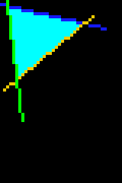

# Aufgabenblatt 2

## Allgemeine Anmerkungen

Ihre Lösung für dieses Aufgabenblatt ist bis Montag, 27.3. 11h durch `git commit` und `push`
abzugeben. Mit der Angabe werden folgende Dateien mitgeliefert: `Point.java`,`SimplePointQueue.java`,
`SimplePointColorMap.java`,`SimpleSparseRasterRGB.java` und `Aufgabe2Test.java`. Diese Klassen 
dürfen nur an den Stellen verändert werden, die mit TODO markiert sind. Zusätzliche Klassen,  
Interfaces, Methoden und Variablen dürfen aber eingefügt werden. Wenn Sie zusätzlich zu den 
gefragten Klassen weitere Klassen definieren, achten Sie darauf, dass die Klassennamen mit `My` 
beginnen, um Konflikte mit späteren Aufgabenblättern zu vermeiden.

## Ziel

Ziel der Aufgabe ist die Implementierung einer linearen und einer assoziativen Datenstruktur (siehe
Skriptum Seiten 50-59).

## Beschreibung der gegebenen Klassen
- `Point` ist das Gerüst einer Klasse, die 2D-Punkte mit ganzzahligen Koordinaten repräsentiert. 
  Die Klasse wird zur Repräsentation von Pixelpositionen im Bildraster benutzt.
- `SimplePointQueue` ist das Gerüst für eine Implementierung einer linearen Datenstruktur zur Verwaltung
  von Objekten des Typs `Point`.
- `SimplePointColorMap` ist das Gerüst für eine Implementierung einer assoziativen Datenstruktur, die
  eine Pixelposition (2D-Punkt) mit der Farbe des Pixels assoziiert.
- `SimpleSparseRasterRGB` ist das Gerüst für eine Implementierung einer Klasse zur Repräsentation 
  von RGB-Bildern. Die Klasse hat die selbe Funktionalität wie die Klasse `SimpleRasterRGB` aus 
  Aufgabenblatt 1, mit einer Erweiterung: es gibt eine zusätzliche Methode, die das Einfärben 
  einer zusammenhängenden Pixelregion mittels Floodfill-Algorithmus ermöglicht. 
- Ein wesentlicher Unterschied von `SimpleSparseRasterRGB` zur Klasse `SimpleRasterRGB` aus 
  Aufgabenblatt 1 ist die Implementierung: Die interne Darstellung des Rasters basiert auf der 
  Klasse `SimplePointColorMap`, die Pixelpositionen mit korrespondierenden Farbwerten assoziiert. 
  Es sollen dabei nur jene Pixel explizit gespeichert werden, die einen Farbwert != (0,0,0) haben. 
  Für Zeichnungen, bei denen die meisten Pixel den Hintergrundfarbwert (0,0,0) haben, ist diese 
  interne Darstellung unter Umständen effizienter.
- `Aufgabe2Test` ist eine vorgegebene Klasse, die Sie zum Testen Ihrer Implementierung verwenden
  sollten. Bei einer fehlerfreien Implementierung sollten bei der Ausführung dieser Klasse keine
  Exceptions geworfen werden und alle Tests als erfolgreich ("successful") ausgegeben werden. Sie
  müssen diese Klasse nicht verändern, können aber eigene Testfälle hinzufügen.

## Aufgaben

Ihre Aufgaben sind folgende:

1. Vervollständigen Sie in der Klasse `Point` die Methode `compareTo` gemäß den Kommentaren. Diese 
   Methode definiert eine Ordnungsrelation (eine "kleiner"-Relation) für Objekte dieser Klasse. 
   Für die Implementierung gibt es mehrere Möglichkeiten, eine davon ist die 
   Nutzung der lexikographischen Ordnung, bei der die x-Koordinate primär ausschlaggebend ist 
   und nur bei gleicher x-Koordinate die y-Koordinate die Relation bestimmt:
   (0,0) < (0,1) < (0,2) < ... < (1,0) < (1,1) < (1,2) < ... < (2,1) < (2,2) ...                 
   Sie können aber auch eine andere Ordnungsrelation nutzen.
2. Vervollständigen Sie die Klassendefinitionen in `SimplePointQueue.java` gemäß den Kommentaren
   in den Dateien. Die Implementierung soll mithilfe eines Arrays erfolgen. Bei der Erzeugung soll das
   Array die Länge haben, die im Konstruktor angegeben wird. Diese wird verdoppelt, sobald alle
   Plätze belegt sind. Benutzen Sie keine vorgefertigten Klassen aus dem Java-Collection-Framework!
3. Vervollständigen Sie die Klassendefinition in `SimplePointColorMap.java`. Die Implementierung 
   soll wieder wie oben beschrieben mit Hilfe von Arrays erfolgen. Benutzen Sie keine 
   vorgefertigten Klassen aus dem Java-Collection-Framework! 
4. Vervollständigen Sie die Klassendefinition in `SimpleSparseRasterRGB.java`. Die Methode 
   `floodFill` soll den [Floodfill](https://de.wikipedia.org/wiki/Floodfill)-Algorithmus unter 
   Verwendung der 4-Nachbarschaft implementieren. Die Methode soll nicht rekursiv implementiert
   werden, sondern eine Queue benutzen. Dazu sollen Sie ein `SimplePointQueue`-Objekt verwenden.
   In der Queue werden noch nicht eingefärbte Nachbarpositionen der aktuell bearbeiteten Position 
   abgelegt. Die Queue enthält also Positionen, die noch auf Bearbeitung warten. 
5. Implementieren Sie auch die Methode `convolve`. Die Methode `convolve` soll so implementiert 
   werden, dass sie den Vorteil von dünn besetzten Rastern nutzt und nur an jenen Positionen  
   Berechnungen durchführt, wo ein Pixelwert != 0 zu erwarten ist. Dazu kann die Methode `keys()`
   der Klasse `SimplePointColorMap` benutzt werden.
6. Vervollständigen Sie die Klasse `PhotoApp2` so, dass folgende Operationen ausgeführt werden: 
   Zeichnen von 3 unterschiedlichen Linien, wobei jede der Linien zwei verschiedene Schnittpunkte 
   mit den anderen beiden Linien hat. Danach soll die Region, die von den drei Linien begrenzt 
   wird, mit `floodFill` eingefärbt werden. Danach soll eine Filterung mit `convolve` erfolgen. 
   Anschließend soll die Region wieder schwarz (0,0,0) gefärbt werden. Geben Sie das Bild nach jedem 
   Schritt aus. Die Ergebnisse der Operationen könnten wie folgt aussehen:

|                             |                       |                              |
|--------------------------------------------------|--------------------------------------------|------------------------------------------------------|
| Abbildung 1: Drei Linien und danach `floodFill`. | Abbildung 2: Weichzeichnen mit `convolve`. | Abbildung 3: `floodFill` mit dem Wert `Color.BLACK`. |

### Denkanstöße (ohne Bewertung)
Folgende Frage ist als Denkanstoß gedacht und bildet die Grundlage für eine Diskussion in der 
Übungseinheit zu diesem Aufgabenblatt.

 - Wäre es sinnvoll, die Klasse `SimplePointColorMap` so zu implementieren, dass die Einträge im 
   Array gemäß der durch die `compareTo`-Methode von `Point` gegebenen Ordnungsrelation  
   sortiert sind, um binäre Suche nach dem Schlüssel zu ermöglichen? Was wären Vor- und Nachteile?

#### _Punkteaufteilung_

- Implementierung von `Point`: 0.5 Punkte
- Implementierung von `SimplePointQueue`: 2 Punkte
- Implementierung von `SimplePointColorMap`: 2 Punkte
- Implementierung von `SimpleSparseRasterRGB`: gesamt 3 Punkte
  - Konstruktor, `getPixelColor`, `setPixelColor`, `getWidth`, `getHeight`: 0.5 Punkte
  - `floodFill`: 1 Punkt
  - korrekte Funktionalität der `convolve` Methode
    (ohne Ausnutzen dünn besetzter Raster): 0.5 Punkte
  - `convolve` Methode zusätzlich optimiert für dünn besetzte Raster: 1 Punkt
- Anpassung von `PhotoApp2`: 0.5 Punkte
- Gesamt: 8 Punkte

